# Platform Screenshots

Visual documentation of the CloudNative SaaS Platform components, dashboards, and interfaces.

## 📊 Grafana Dashboards

### Sample App Dashboard

**Location**: Grafana → Dashboards → Sample App Dashboard

**What to capture:**
- Overall dashboard view showing all panels
- Memory Usage by Namespace panel
- CPU Usage by Namespace panel
- Pods per Namespace gauge
- Node CPU and Memory usage

**Screenshot:**
<!-- Add screenshot: screenshots/grafana-sample-app-dashboard.png -->
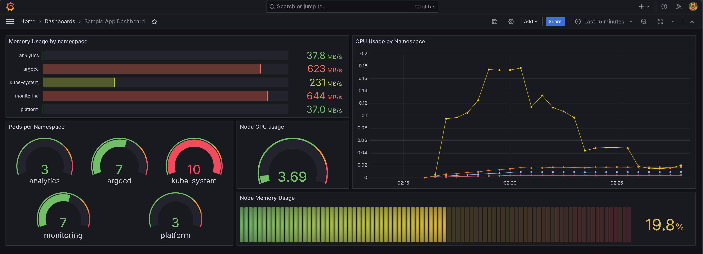

**Description**: Complete view of the Sample App Dashboard showing namespace-level and node-level metrics. The dashboard displays:
- **Memory Usage by Namespace**: Bar gauge showing memory consumption per namespace (analytics: 37.8 MB/s, argocd: 623 MB/s, kube-system: 231 MB/s, monitoring: 644 MB/s, platform: 37.0 MB/s)
- **CPU Usage by Namespace**: Time-series graph showing CPU trends with a spike around 02:19-02:20
- **Pods per Namespace**: Individual gauges showing pod counts (analytics: 3, argocd: 7, kube-system: 10, monitoring: 7, platform: 3)
- **Node CPU Usage**: Overall cluster CPU at 3.69% (very low)
- **Node Memory Usage**: Average node memory at 19.8% (low utilization)

---

## 🗄️ Database (RDS PostgreSQL)

### Tenants Table Query

**What to capture:**
- Query results from `tenants` table
- Platform and Analytics tenant records
- Tenant metadata (id, tenant_id, name, namespace, timestamps)

**Screenshot:**
<!-- Add screenshot: screenshots/database-tenants-table.png -->
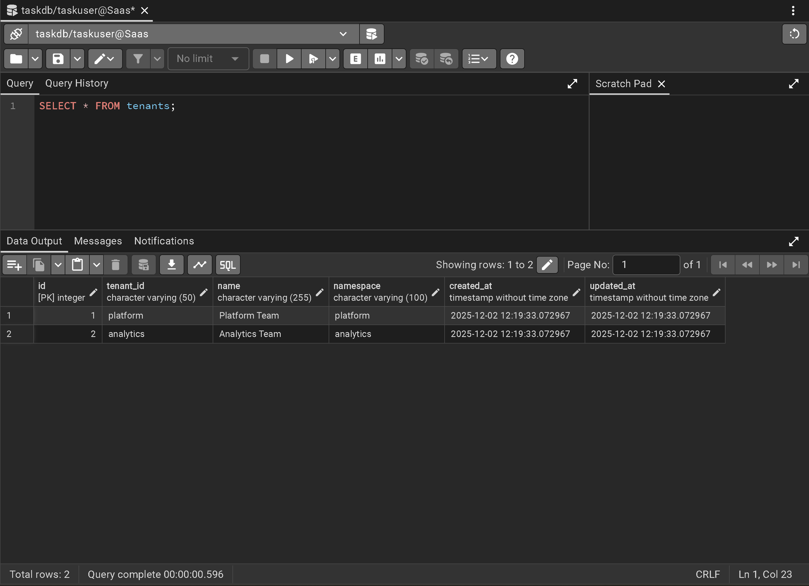

**Description**: Query results showing all tenants in the database with their metadata including tenant_id, name, namespace, and creation timestamps.

---

### Platform Tenant Users

**What to capture:**
- Users in `tenant_platform.users` table
- User authentication data
- Tenant isolation verification

**Screenshot:**
<!-- Add screenshot: screenshots/database-platform-users.png -->
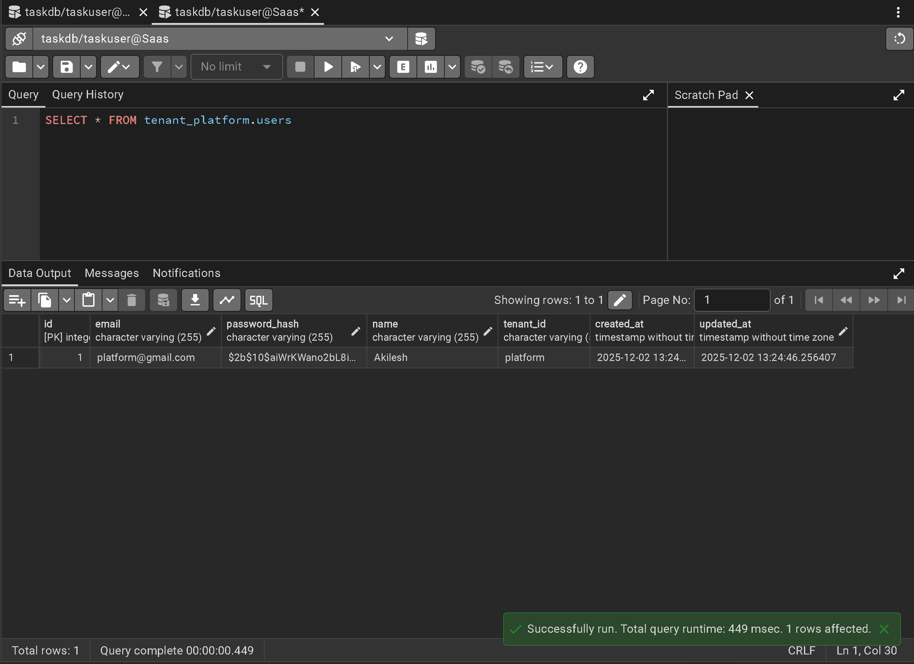

**Description**: User records from the platform tenant schema, showing email, password hash, name, and tenant_id for data isolation verification.

---

### Analytics Tenant Users

**What to capture:**
- Users in `tenant_analytics.users` table
- User authentication data
- Tenant isolation verification

**Screenshot:**
<!-- Add screenshot: screenshots/database-analytics-users.png -->
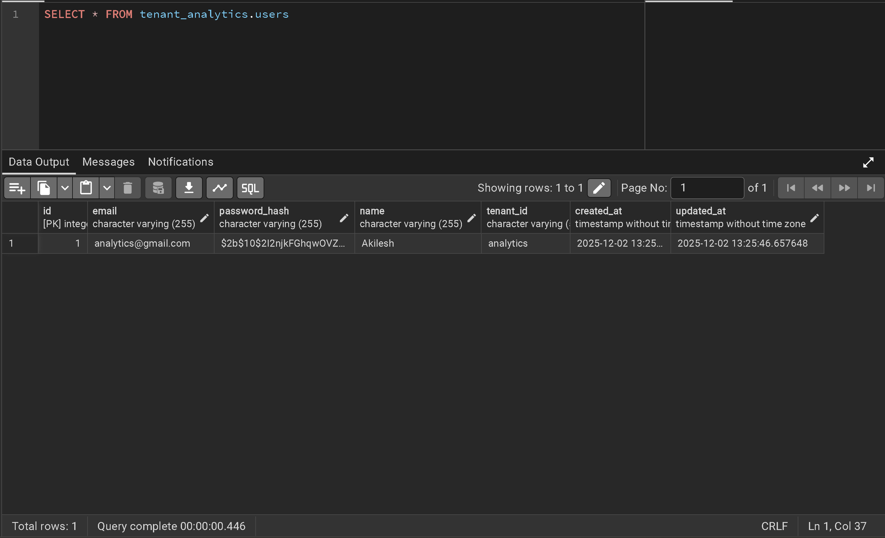

**Description**: User records from the analytics tenant schema, confirming proper schema-level isolation between tenants.

---

## 🚀 Application (Sample SaaS App)

### Platform Tenant Dashboard

**What to capture:**
- Task Management Sample App for Platform tenant
- Task dashboard with statistics
- Resource usage metrics
- User information display

**Screenshot:**
<!-- Add screenshot: screenshots/app-platform-dashboard.png -->
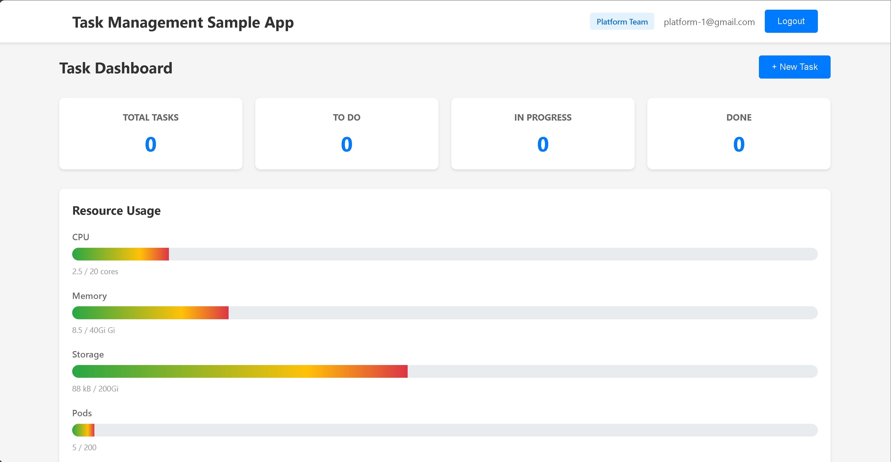

**Description**: Task Management Sample App dashboard for the Platform tenant showing:
- User: Platform Team (platform-1@gmail.com)
- Task statistics: Total Tasks, To Do, In Progress, Done (all showing 0)
- Resource Usage: CPU (2.5/20 cores), Memory (8.5/40Gi), Storage (88 kB/200Gi), Pods (5/200)
- Clean, modern UI with resource usage progress bars

---

### Analytics Tenant Dashboard

**What to capture:**
- Task Management Sample App for Analytics tenant
- Task dashboard with statistics
- Resource usage metrics
- User information display

**Screenshot:**
<!-- Add screenshot: screenshots/app-analytics-dashboard.png -->
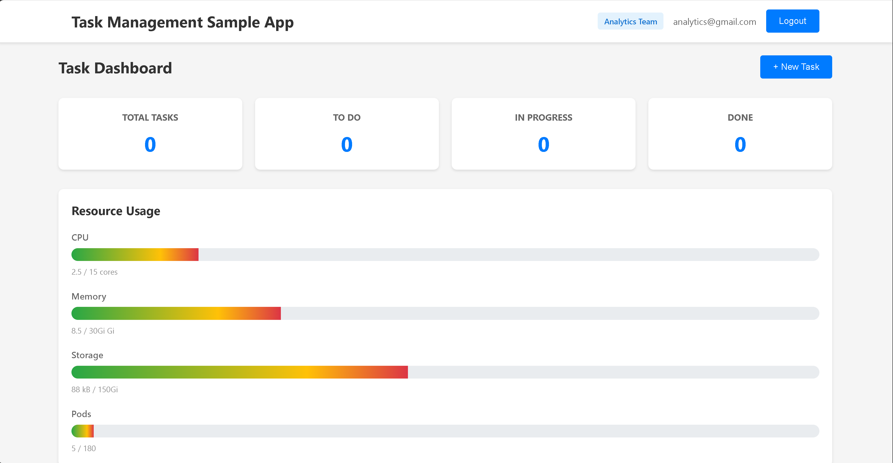

**Description**: Task Management Sample App dashboard for the Analytics tenant showing:
- User: Analytics Team (analytics@gmail.com)
- Task statistics: All categories showing 0 tasks
- Resource Usage: CPU (2.5/15 cores), Memory (8.5/30Gi), Storage (88 kB/150Gi), Pods (5/180)
- Demonstrates proper tenant isolation with different resource quotas

## ☸️ Kubernetes Resources

### Kubernetes Verification Output

**What to capture:**
- Namespace listing (analytics, data, platform)
- Resource quotas per namespace
- Network policies configuration
- Service accounts and RBAC roles

**Screenshot:**
<!-- Add screenshot: screenshots/k8s-verification-output.png -->
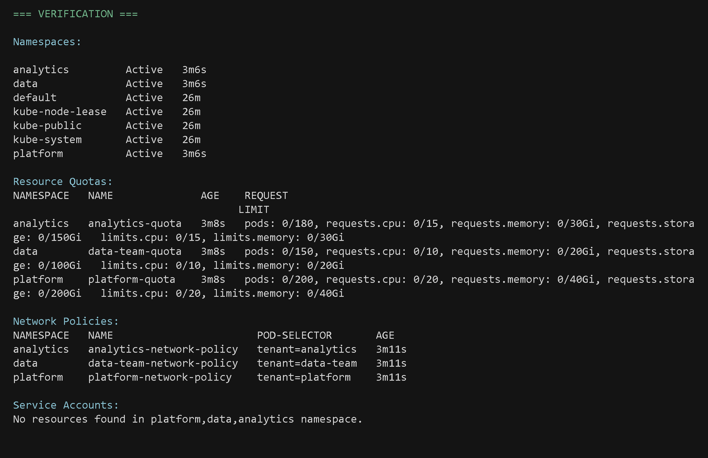

**Description**: Complete verification output showing all tenant namespaces, their resource quotas (CPU, memory, storage, pods), network policies with pod selectors, and service accounts. Confirms proper multi-tenant isolation and resource governance.

## 🔐 AWS Resources

### Terraform Infrastructure Outputs

**What to capture:**
- Terraform output command results
- EKS cluster information
- VPC and networking details
- Security group IDs
- IAM role ARNs

**Screenshot:**
<!-- Add screenshot: screenshots/terraform-outputs.png -->

**Description**: Complete Terraform outputs showing:
- **Cluster**: `saas-infra-lab-dev` (v1.32) in `us-east-1`
- **VPC**: `vpc-0747522334f1ea9d7`
- **Subnets**: 3 public and 3 private subnet IDs
- **Security Groups**: Cluster SG (`sg-08a81b2255b144adf`), Nodes SG (`sg-01bcef5f509ddb257`)
- **IAM Roles**: Cluster role and Node role ARNs
- **kubeconfig command**: Ready-to-use command for cluster access

## 🔧 CI/CD Pipeline

### CI Workflow (ci.yml)

**Location**: GitHub Actions → Workflows → ci.yml

**What to capture:**
- CI workflow triggered on push
- All test jobs completed successfully
- Execution times for each job

**Screenshot:**
<!-- Add screenshot: screenshots/ci-workflow.png -->
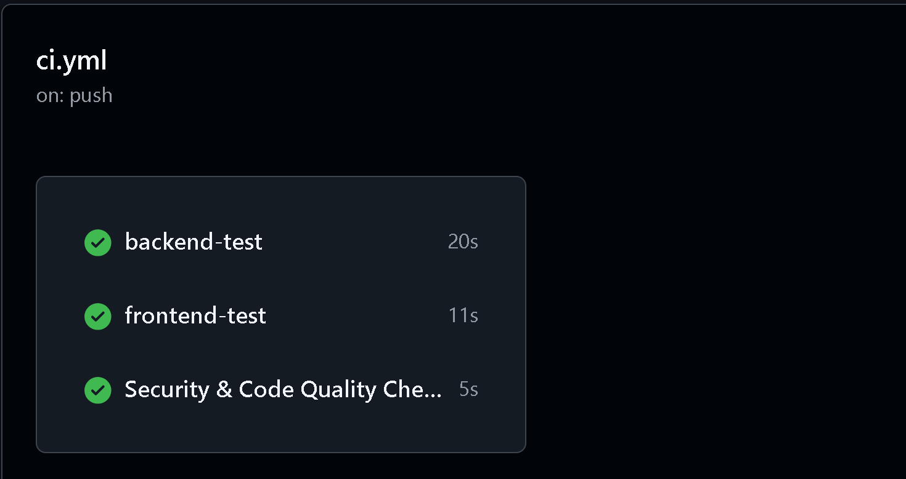

**Description**: Successful CI pipeline execution showing:
- **backend-test**: Completed in 20s
- **frontend-test**: Completed in 11s
- **Security & Code Quality Checks**: Completed in 5s
- All jobs passed with green checkmarks

---

### CD Workflow (cd.yml)

**Location**: GitHub Actions → Workflows → cd.yml

**What to capture:**
- CD workflow triggered by workflow_run
- Build stages (Backend and Frontend in parallel)
- GitOps manifest update step

**Screenshot:**
<!-- Add screenshot: screenshots/cd-workflow.png -->
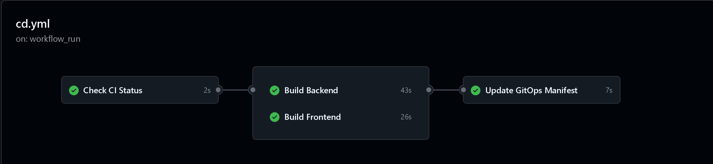

**Description**: Successful CD pipeline execution showing:
- **Check CI Status**: Completed in 2s (validates CI passed)
- **Build Backend**: Completed in 43s (parallel with frontend)
- **Build Frontend**: Completed in 26s (parallel with backend)
- **Update GitOps Manifest**: Completed in 7s (updates image tags in GitOps repo)
- All stages connected sequentially with successful completion

---

### Infrastructure Deployment Workflow (auto-apply-infra.yml)

**Location**: GitHub Actions → Workflows → auto-apply-infra.yml

**What to capture:**
- Infrastructure deployment workflow
- ArgoCD installation step
- Sequential execution flow

**Screenshot:**
<!-- Add screenshot: screenshots/infrastructure-deployment-workflow.png -->
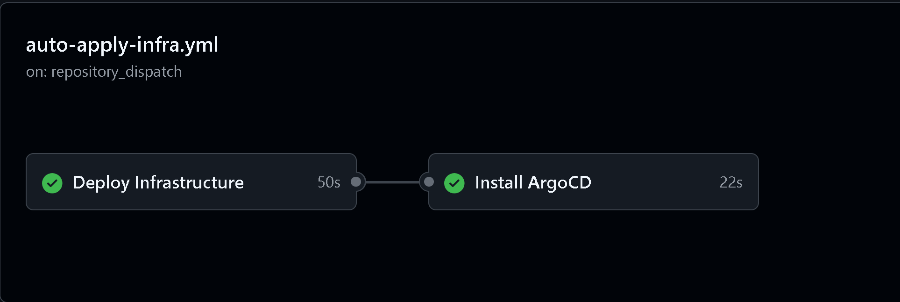

**Description**: Successful infrastructure deployment showing:
- **Deploy Infrastructure**: Completed in 50s (Terraform apply for EKS, VPC, RDS, etc.)
- **Install ArgoCD**: Completed in 22s (installs ArgoCD in the cluster)
- Workflow triggered by `repository_dispatch` event
- Both steps completed successfully with green checkmarks

---

### Deployment Success Message

**What to capture:**
- Deployment completion confirmation
- Infrastructure components deployed
- Tenant namespaces created
- Verification output

**Screenshot:**
<!-- Add screenshot: screenshots/deployment-success.png -->
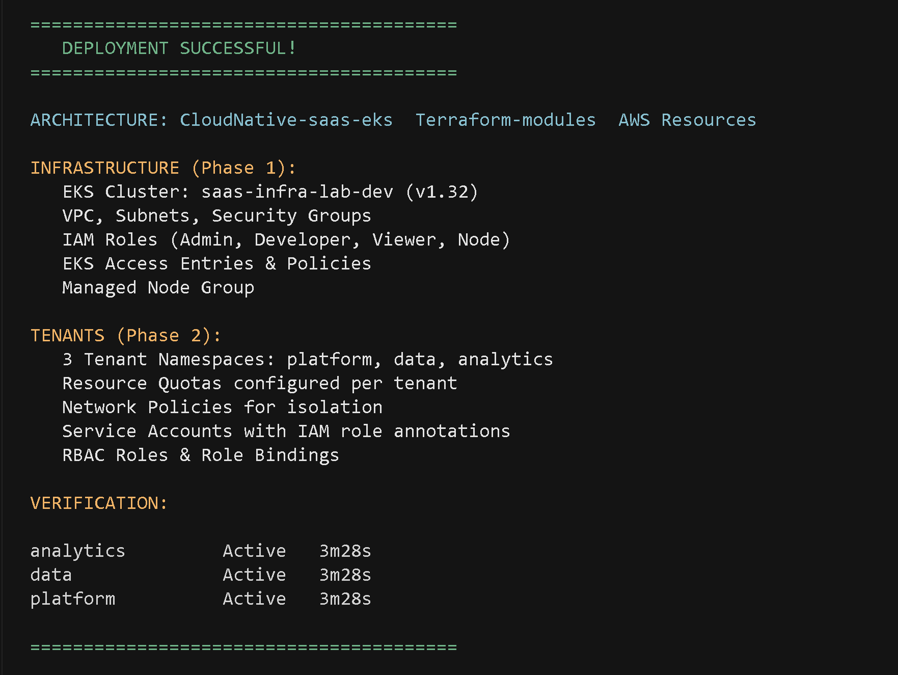

**Description**: Terminal output showing successful deployment with:
- **Infrastructure (Phase 1)**: EKS Cluster (saas-infra-lab-dev v1.32), VPC, Security Groups, IAM Roles, EKS Access Entries, Managed Node Group
- **Tenants (Phase 2)**: 3 Tenant Namespaces (platform, data, analytics), Resource Quotas, Network Policies, Service Accounts with IRSA, RBAC Roles & Role Bindings
- **Verification**: All three tenant namespaces showing as Active

## 💡 Tips

- **Remove sensitive data**: Blur or redact credentials, tokens, IPs before committing
- **Use descriptive names**: Follow the naming convention used in this document
- **Keep file sizes reasonable**: Compress large images if needed

## 🔒 Security Note

**Important**: Before sharing screenshots publicly:
- ✅ Remove or blur sensitive information (credentials, tokens, IPs)
- ✅ Redact AWS account IDs
- ✅ Remove personal data
- ✅ Check for exposed secrets in logs or UI

---

**Ready to add screenshots?** Save them in `Docs/screenshots/` and update this file with the image references!

